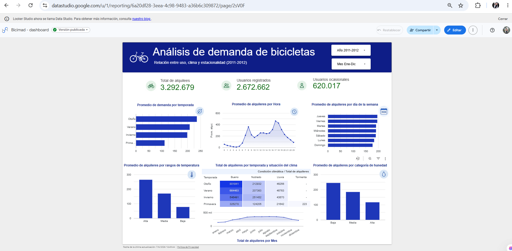
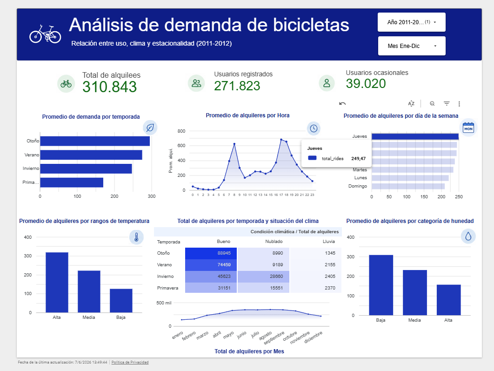

# mci506-bicimad-clima

Pipeline de extracción, transformación y carga (ETL) para datos de BiciMAD
y clima, desarrollado como parte del Módulo 7 del MCI 506.

## Estructura

```
.
├── data/
│   ├── raw/         # Datos crudos descargados por extract.py
│   └── processed/   # Datos transformados
├── scripts/
│   ├── extract.py   # Descarga, validación y carga a GCS
│   ├── transform.py # Limpieza y normalización de datos
│   └── load.py      # Carga a BigQuery (Silver / Gold)
├── sql/
│   ├── bronze.sql           # External tables en BigQuery
│   └── silver_transform.sql # Transformaciones y deduplicación Silver
├── .github/workflows/
│   └── etl.yml      # Pipeline de GitHub Actions
├── requirements.txt
├── .env.example
└── README.md
```

## Fuente de datos

| Archivo | Fuente | URL | Licencia |
| --- | --- | --- | --- |
| `day.csv` / `hour.csv` | UCI Machine Learning Repository — Bike Sharing Dataset | https://archive.ics.uci.edu/dataset/275/bike+sharing+dataset | Para uso académico |

> El dataset de UCI se utiliza como **placeholder público** mientras se
> integran las fuentes definitivas (API de BiciMAD y AEMET). La estructura
> del pipeline no cambia.

## Columnas (`day.csv` / `hour.csv`)

| Columna | Tipo | Descripción |
| --- | --- | --- |
| `instant` | int | Índice de registro |
| `dteday` | date | Fecha |
| `season` | int | 1=primavera, 2=verano, 3=otoño, 4=invierno |
| `yr` | int | 0=2011, 1=2012 |
| `mnth` | int | Mes (1–12) |
| `holiday` | int | 1 si es festivo |
| `weekday` | int | Día de la semana |
| `workingday` | int | 1 si es día laborable |
| `weathersit` | int | 1=bueno, 2=nublado, 3=lluvia, 4=tormenta |
| `temp` | float | Temperatura normalizada (°C/41 máx.) |
| `atemp` | float | Sensación térmica normalizada |
| `hum` | float | Humedad normalizada |
| `windspeed` | float | Viento normalizado |
| `casual` | int | Usuarios ocasionales |
| `registered` | int | Usuarios registrados |
| `cnt` | int | Total de alquileres (`casual + registered`) |

`hour.csv` añade las mismas columnas más `hr` (hora 0–23).

### Nota sobre la variable season

  Durante el análisis exploratorio se verificó que la codificación de la variable `season` no coincide exactamente con los cambios astronómicos de estación observados en las fechas del dataset. Por ejemplo, registros correspondientes al 21 de diciembre aparecen clasificados como `season = 1`, cuando en Washington D.C. dicha fecha corresponde al inicio del invierno.

  Sin embargo, el archivo README original del Bike Sharing Dataset define explícitamente la variable de la siguiente manera:

  - 1 = Spring
  - 2 = Summer
  - 3 = Fall
  - 4 = Winter

  Por consistencia con la documentación oficial y para garantizar la reproducibilidad de los análisis, se mantuvo la codificación original proporcionada por los autores del dataset. Esta decisión fue documentada debido a que la clasificación estacional parece haber sido preprocesada previamente y no necesariamente sigue los límites astronómicos exactos.

## Configuración

Copia `.env.example` a `.env` y rellena los valores. **No commitees `.env`.**

```ini
GCS_BUCKET_NAME=
GOOGLE_APPLICATION_CREDENTIALS=
```

- `GCS_BUCKET_NAME` — nombre del bucket destino. Si está vacío, `extract.py`
  omite la subida a GCS.
- `GOOGLE_APPLICATION_CREDENTIALS` — ruta al JSON de la service account de GCP.

## Instalación

```bash
python -m venv .venv
.venv\Scripts\activate            # Windows
pip install -r requirements.txt
```

## Uso

### Extracción

```bash
python scripts/extract.py                  # CSV, sube a GCS si está configurado
python scripts/extract.py --formato parquet
python scripts/extract.py --skip-gcs       # no sube a GCS
```

Salida esperada:

- `data/raw/day.csv` y `data/raw/hour.csv` (o `.parquet`)
- Subida opcional a `gs://<bucket>/raw/...`

### Transformación

```bash
python scripts/transform.py
```

Salida esperada: `data/processed/day.csv` y `data/processed/hour.csv`

> **Nota:** Este script cumple el requisito académico de la etapa Transform en Python.
> En el pipeline productivo, la transformación equivalente se ejecuta directamente
> en BigQuery con `sql/silver_transform.sql` (SAFE_CAST, renombrado, deduplicación
> sobre la external table del Bronze layer que apunta a los CSV en GCS).

### Carga a BigQuery

```bash
python scripts/load.py --capa silver
python scripts/load.py --capa gold
python scripts/load.py --capa ambas
```

> **Nota:** Este script cumple el requisito académico de la etapa Load en Python.
> En el pipeline productivo, las capas Silver y Gold se crean y actualizan
> directamente en BigQuery con los archivos de `sql/` — no se requiere carga
> desde Python porque BigQuery lee los CSV directamente desde GCS vía external tables.

## Automatización

El pipeline se ejecuta automáticamente mediante **GitHub Actions** (`.github/workflows/etl.yml`).

| Trigger | Descripción |
| --- | --- |
| Push a `main` | Se ejecuta en cada merge al branch principal |
| `workflow_dispatch` | Ejecución manual desde la pestaña Actions en GitHub |

**Pasos del workflow:**

1. Clonar el repositorio
2. Instalar Python 3.11 y dependencias (`requirements.txt`)
3. Configurar credenciales de GCP desde los Secrets del repo
4. Ejecutar `python scripts/extract.py`

**Secrets requeridos en el repositorio de GitHub:**

| Secret | Descripción |
| --- | --- |
| `GCP_CREDENTIALS` | JSON completo de la service account de GCP |
| `GCS_BUCKET_NAME` | Nombre del bucket destino en GCS |

## BigQuery

El data warehouse usa tres capas en el dataset `bike_sharing_dw` del proyecto `mci506-bicimad-clima-v2`.

| Capa | Tabla | Archivo SQL | Estado |
| --- | --- | --- | --- |
| Bronze | `bronze_day`, `bronze_hour` | `sql/bronze.sql` | ✅ |
| Silver | `silver_day`, `silver_hour` | `sql/silver_transform.sql` | ✅ |
| Gold | | `sql/gold_aggregations.sql` | ✅ |

**Bronze** — External tables apuntando directamente a los archivos en GCS (`gs://bike_sharing_v2/raw/`).

**Silver** — Tablas nativas con limpieza de tipos (`SAFE_CAST`), renombrado de columnas y deduplicación con `ROW_NUMBER() OVER (PARTITION BY ride_id)`.

**Gold** — Agregaciones por mes, año, métricas de alquileres y de clima.

## Dashboard

El dashboard está construido en **Looker Studio** conectado a la tablas Silver y Gold de BigQuery.
Muestra el comportamiento de la demanda de bicicletas según temporada, día de la semana, horarios y clima.

**Responsable:** Jennifer Suarez

### Visualizaciones

1. Demanda promedio por temporada.
2. Demanda promedio por hora del día.
3. Demanda promedio por día de la semana.
4. Relación entre temperatura y alquileres.
5. Relación entre humedad y alquileres.
6. Demanda por condición climática y temporada.
7. Evolución mensual de alquileres (métrica Gold).

### Hallazgos principales

El análisis realizado en Looker Studio permitió identificar los siguientes patrones de comportamiento en la demanda de bicicletas:

- Las horas de mayor utilización corresponden a los periodos de desplazamiento laboral, observándose picos de demanda en la mañana (8:00) y al finalizar la jornada (17:00).
- Los días laborables presentan una demanda ligeramente superior a los fines de semana, siendo jueves el día con mayor pico de demanda.
- La temperatura muestra una relación positiva con la cantidad de alquileres: a medida que aumenta la temperatura promedio, también aumenta el uso del servicio.
- Los niveles elevados de humedad se asocian con una disminución en la demanda de bicicletas.
- La demanda presenta un comportamiento estacional claramente definido.

#### Validación del comportamiento estacional

Para validar el comportamiento estacional, se analizó la **evolución mensual** de los alquileres de bicicletas. Los resultados muestran que la demanda comienza a incrementarse progresivamente durante la primavera, continúa creciendo durante el verano y alcanza su punto máximo en agosto, que representa el mes con mayor cantidad de alquileres. Posteriormente, durante el otoño, se observa una disminución gradual de la demanda, mientras que los niveles más bajos se registran en invierno.

El comportamiento observado permite concluir que la estacionalidad del negocio sigue el patrón esperado para un sistema de bicicletas compartidas en el hemisferio norte:

**Verano > Primavera > Otoño > Invierno**

Este hallazgo fue considerado durante la interpretación de los resultados del dashboard para evitar conclusiones erróneas derivadas únicamente de la codificación original del dataset.

### Acceso

> **Dashboard en Looker Studio:** https://datastudio.google.com/reporting/6a20df28-3eea-4c98-9483-a36b6c309872

### Capturas de pantalla





## Estado del proyecto

- [x] Estructura inicial del repositorio
- [x] `extract.py` funcional con descarga, validación y carga a GCS
- [x] `requirements.txt` y `.gitignore`
- [x] `transform.py` (limpieza y normalización)
- [x] `load.py` (carga a BigQuery — Silver / Gold)
- [x] SQL Bronze (external tables en BigQuery)
- [x] SQL Silver (limpieza y deduplicación)
- [x] GitHub Actions (`etl.yml`) ejecutando el pipeline
- [x] SQL Gold (agregaciones y métricas)
- [x] Dashboard Looker Studio (3+ visualizaciones)
- [x] Documentación final del README

## Equipo

| Nombre | Rol |
| --- | --- |
| Daniela Caro | Data Engineer Python — `extract.py`, `transform.py` |
| Daniel Ribera | BigQuery / SQL — Bronze, Silver, Gold |
| Jennifer Suarez | Dashboard / Documentación — Looker Studio, capturas, README |
| Simon Alex Rodriguez | Líder / Integrador — repo, revisión, GitHub Actions |

## Cómo contribuir

Guía paso a paso para integrantes del equipo:

### 1. Clonar el repositorio

```bash
git clone https://github.com/SimonLexRS/mci506-bicimad-clima.git
cd mci506-bicimad-clima
```

### 2. Crear una rama

Usa la convención de nombres del proyecto:

```bash
git checkout -b feature/nombre-descriptivo   # nueva funcionalidad
git checkout -b fix/nombre-del-bug           # corrección de error
git checkout -b docs/nombre-del-cambio       # documentación
```

### 3. Configurar el entorno local

```bash
python -m venv .venv
.venv\Scripts\activate          # Windows
pip install -r requirements.txt

cp .env.example .env            # completar GCS_BUCKET_NAME y GOOGLE_APPLICATION_CREDENTIALS
```

### 4. Verificar que extract.py funciona

```bash
python scripts/extract.py --skip-gcs
```

Debe terminar con `Extracción completada exitosamente ✓` y crear los archivos en `data/raw/`.

### 5. Hacer commits con formato convencional

```bash
git add scripts/extract.py
git commit -m "feat: descripción breve del cambio"
```

Prefijos válidos: `feat:`, `fix:`, `docs:`, `build:`, `refactor:`, `test:`

### 6. Abrir un Pull Request

```bash
git push origin feature/nombre-descriptivo
```

Luego ir a GitHub → **Pull requests** → **New pull request**, seleccionar la rama y completar la descripción con qué cambió y por qué.

### 7. Esperar revisión

Otro integrante del equipo debe revisar el PR antes del merge a `main`. No hacer merge sin aprobación.
